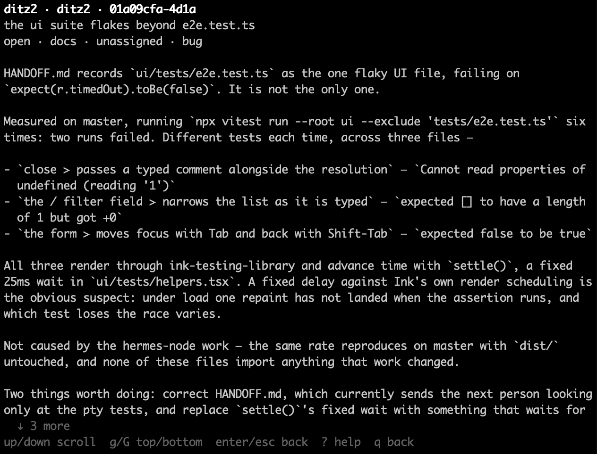
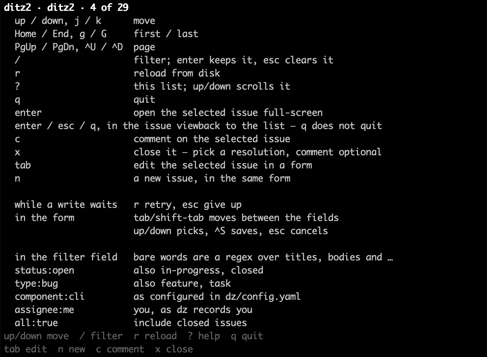

# ditz2-ui

A full-screen terminal UI for [ditz2](../README.md), built on Ink.

Neither package is published yet, so install from a clone:

```
git clone <this repo> && cd ditz2
npm install                     # links ditz2 into ui/ as a workspace
npm run build                   # the ditz2 CLI
npx tsc -p ui/tsconfig.json && chmod +x ui/dist/main.js
node ui/dist/main.js
```

The UI build avoids `npm run build --workspace ditz2-ui` deliberately. The npm
this project's toolchain resolves to is 8.19.4, which discards the exit code of
any script run in a workspace member — so a failed build reports success and
the next line fails with `ERR_MODULE_NOT_FOUND` instead. See `CLAUDE.md`.

Once both are on a registry this becomes:

```
npm i -g ditz2-ui
dz ui          # or: dzui
```

It is a separate package on purpose. Ink and React are 38 packages and about
23 MB, and someone who wants a command-line issue tracker should not have to
install a React reconciler to get one. `ditz2` does not depend on this package;
`dz ui` finds it with a dynamic import and prints an install hint if it is not
there.

## What it does

Browse, filter and read — and now write: `c` comments on the selected issue,
`x` closes it, `tab` edits its fields in a form and `n` opens that same form
empty to create one. Everything it shows, `dz list`, `dz show` and `dz grep`
already show, and everything it writes goes through the same `ditz2` public API
the CLI writes through, under the same project lock and the same validation.
There is no second implementation to drift. Issue **bodies** are still `dz` —
the form shows how many lines one has and leaves it alone — as is **managing
the component list**: the form picks an issue's component out of what
`dz component add`/`rm` has configured, and offers no way to change that list.
`doctor` and `init` are `dz`-only too.



Because a write can be refused, two refusals have screens of their own. A lock
held by someone else — an agent, or your own `dz` in another window — is a
waiting overlay that names the holder and counts, with `r` to try again; the UI
never blocks on the lock, so it stays repaintable and interruptible throughout.
Anything else the facade refuses — a missing or malformed author identity above
all — is shown on the status line, over a list that stays fully usable. `Esc`
dismisses the message. The overlay itself is gone by then, so pressing `^S`
again does nothing; press `c`, `x`, `tab` or `n` to reopen one.

Reopening **the same** form on **the same** issue brings back what you typed —
the comment, the resolution `x` was showing, or every field of the edit form —
so you can fix the problem and save. Anything else starts clean, because a
draft belongs to the form it was typed in: a sentence meant as a comment must
not end up written as the reason an issue was closed. The two halves of the
close form come back together or not at all, which is the point. A resolution
that reset itself while the words stayed would look like the whole form had
returned, and the next `^S` would write `fixed` over the `wontfix` you chose.

The field form is a third surface with the same rule and one consequence worth
knowing. A refused `n` is kept only for the next `n`: press `tab` instead and
the new issue you were describing is gone, because a held form is matched on
its mode and its issue, and `n` and `tab` never share both. That is deliberate
and it is the same rule that keeps a comment out of a close, but it is a
sharper edge here, because a form can hold five fields rather than one
sentence.

One more consequence of having a single owner for each rule: `^S` on a new
issue with an empty title takes the project lock before it is refused, because
the rule that a title cannot be empty belongs to the facade and the UI keeps no
copy of it to pre-empt with. So the first mistake can meet an agent's write and
come back as a wait rather than as an immediate no. That is the price of not
having a second copy of the rule, and it is deliberate.

## Keys

| | |
| --- | --- |
| `up`/`down`, `j`/`k` | move |
| `Home`/`End`, `g`/`G` | first / last |
| `PgUp`/`PgDn`, `^U`/`^D` | page |
| `/` | filter — `enter` keeps it, `esc` clears it |
| `c` | comment on the selected issue — `^S` writes it, `esc` abandons it |
| `x` | close it — `tab` switches field, the arrows pick a resolution, `^S` writes it, `esc` abandons it |
| `tab` | edit the selected issue's fields — `tab`/`shift-tab` move, the arrows pick, `^S` saves, `esc` abandons |
| `n` | a new issue, in the same form — title, type and component, the three `dz add` takes |
| `r` | reload from disk |
| `?` | the list and issue screen bindings, plus the form's and the waiting overlay's. The comment and close overlays' own keys are advertised in their footers and nowhere else. `?` does not reach into the comment, close, form, waiting or filter overlays; an error message is the exception, since the list under it stays live, and `?` there replaces the message with this list |
| `q` | quit |

`?` shows that same list in the app, so you never need this file open to use it:



The filter field takes bare words as a regex over titles, bodies and log
entries, and `status:`, `type:`, `component:`, `assignee:` and `all:` as
filters. `assignee:me` resolves to your configured identity. Arrow keys keep
working while the field is open, so you can type and walk the matches at once.

## What it does not do

It does not watch the filesystem. The screen is a snapshot taken at startup and
replaced by `r`, so an agent closing an issue you are looking at will not update
the display. This is deliberate: a list that reorders under a moving cursor is
worse than one that is briefly stale. Staleness is not free, though, and the
form narrows the cost without closing it: `^S` sends only the fields you
actually changed, and the facade applies them to a fresh read of the file under
the project lock. So a concurrent edit to a field you did not touch survives —
and one to a field you did touch is overwritten with what your screen showed,
silently. Nothing here compares a baseline; `dz edit` is the operation that
does, and it refuses rather than overwrites. Press `r` before editing an issue
you know an agent also has open.

It does not fold a form. The close form's resolution picker, its two labels and
a line of comment are all load-bearing, so on a terminal too short for them `x`
says *the close form needs a taller terminal* on the status line instead of
opening. `tab` and `n` say *the form needs a taller terminal* for the same
reason: the field form reserves room for its tallest picker fully expanded,
since focus moves while it is open and a picker that fits on opening must not
overflow two Tabs later. Drawing a form whose bottom is off the screen would
make the terminal scroll, and from then on what you see stops matching what you
would be writing.

`n` opens from a shorter terminal than `tab` does, and the exact heights depend
on your project. The form asks for one row per field it will draw plus its
tallest picker plus four of its own chrome, and `n` draws three fields where
`tab` draws five — so a project with more components needs a taller terminal
for both, and there is a band in between where `n` works and `tab` declines.
Over a two-component project the two thresholds measured 16 and 18 terminal
rows. There is no scrolling picker; a project with a great many components
cannot use the form on a short terminal at all.
